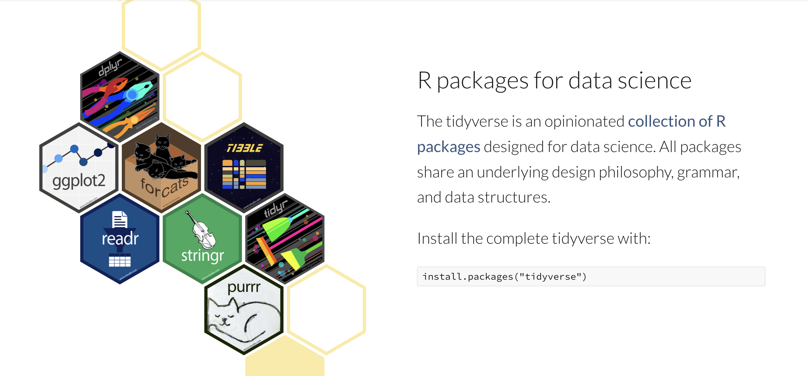
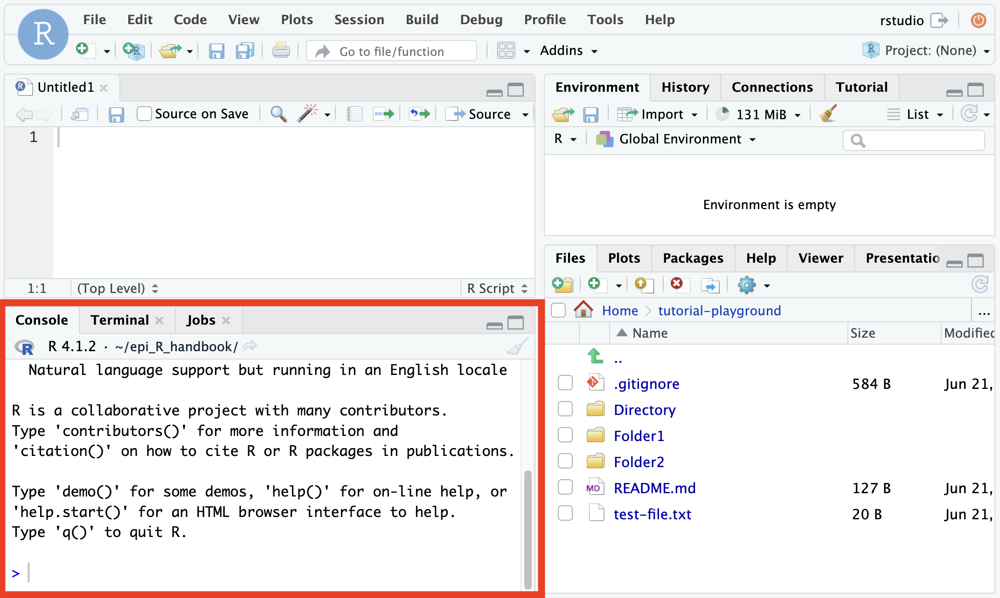
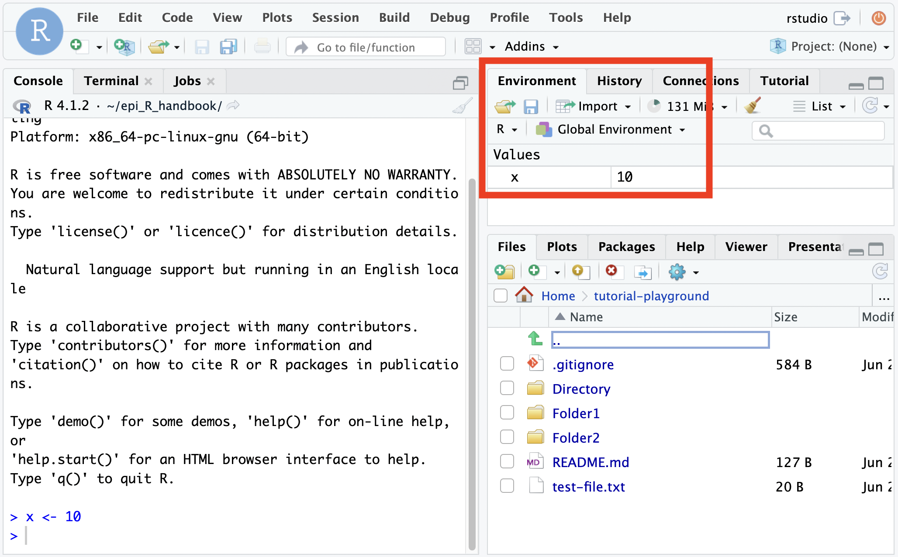
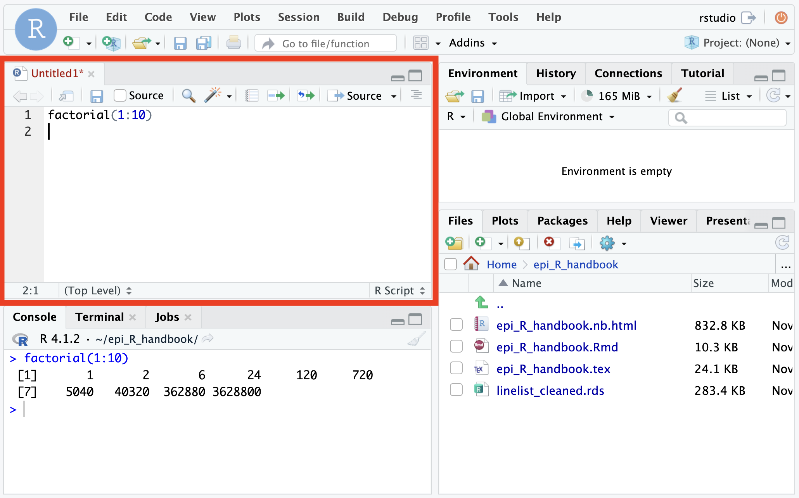
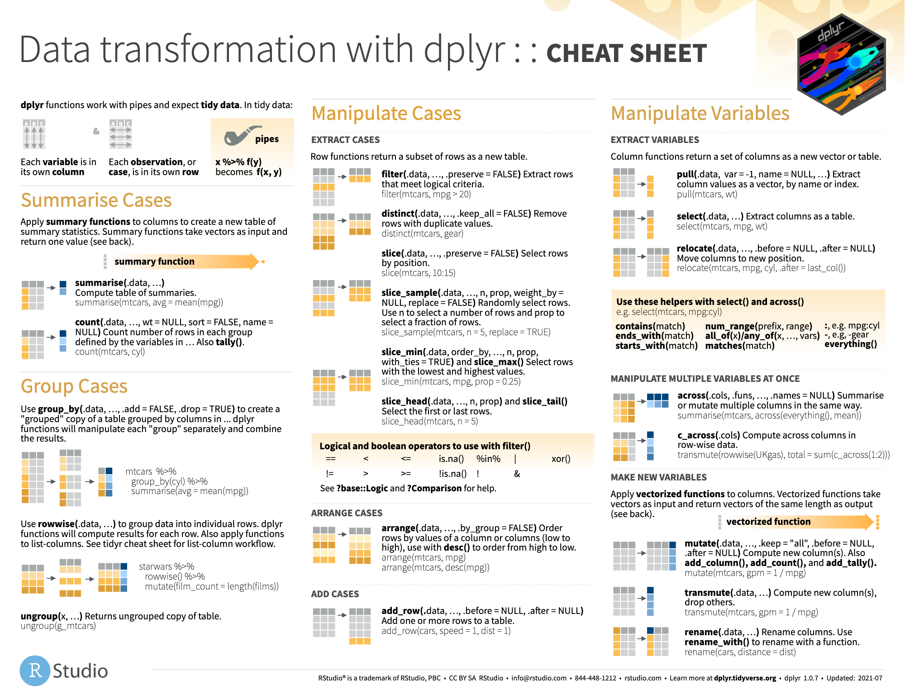
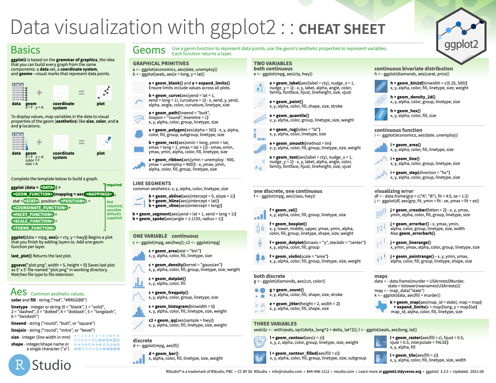

Tabular Data Foundations
========================================================
author: Alejandro Schuler
date: 2022
transition: none
width: 1680
height: 1050

Adapted from [Steve Bagley](https://profiles.stanford.edu/steven-bagley) and based on [R for Data Science by Hadley Wickham](https://r4ds.had.co.nz/)

Edited by David Connell


<style>
.small-code pre code {
  font-size: 0.5em;
}
</style>

Introduction
========================================================
type: section


Goals of this course
========================================================
By the end of these slides you should be able to...

- write simple R scripts
- find, read, and understand package and function documentation 
- read and write tabular data into R from CSV files
- manipulate and subset tabular data


Resources for this tutorial
========================================================

## Tidyverse

- The tidyverse collection of R packages is used in this tutorial, and in PHW142, to provide lots of additional functionality that's not present in the basic R programming language.



Resources for this tutorial
========================================================


***
## [R for Data Science (R4DS) free online book by Hadley Wickham](https://r4ds.had.co.nz)

- Fundamentals: ch 1, 4, 6
- Input/output: ch 11
- Data manipulation: ch 5, 13
- Visualization: ch 3, 28

## [RStudio cheatsheets](https://www.rstudio.com/resources/cheatsheets/)

- Extremely useful reference guides for functions used in this tutorial

RStudio
========================================================
type: section


The basics of interaction using the console window
========================================================

If you haven't already, please open RStudio on DataHub by [clicking this link](https://publichealth.datahub.berkeley.edu/hub/user-redirect/git-pull?repo=https%3A%2F%2Fgithub.com%2Fpre-142-training%2Ftutorial-playground&urlpath=rstudio%2F&branch=main). If you're viewing this on bCourses, you'll have to right click and then choose "Open Link in New Tab".

You will get more out of this tutorial if you try out these things in R yourself!!


A simple example in the console
========================================================

The R console window is the left (or lower-left) window in RStudio.

- The box contains an expression that will be evaluated by R, followed by the result of evaluating that expression.

```r
> 1 + 2
[1] 3
```
- `3` is the answer
- `[1]` means: the answer is a vector (a list of elements of the same type) and this line starts with the first element of that vector.
- It does not mean the answer has one element (although that is true in this case).

***



Spaces (mostly) don't matter
========================================================

```r
> 1 +2
> 1+ 2
> 1+2
> 1 + 2
```

These all do the same thing. The result of each line is `3`:


```
[1] 3
```

Basic calculations and vectors
========================================================
type: section

R is a scientific calculator
========================================================

```r
> 1 + 2 * 3 # R respects order of operations
[1] 7
> 3/4
[1] 0.75
> 6^3
[1] 216
> log(10) # natural log
[1] 2.302585
> log10(10) # log base 10
[1] 1
> sqrt(16)
[1] 4
```

Vectors
========================================================

```r
> c(2.1, -4, 22)
[1]  2.1 -4.0 22.0
```
- A vector is a one-dimensional sequence of zero or more numbers (or other values).
- Vectors are created by wrapping the values separated by commas with the `c(` `)` function, which is short for "combine"

```r
> 1:50
 [1]  1  2  3  4  5  6  7  8  9 10 11 12 13 14 15 16 17 18 19 20 21 22 23 24 25
[26] 26 27 28 29 30 31 32 33 34 35 36 37 38 39 40 41 42 43 44 45 46 47 48 49 50
```
- The colon `:` is a handy shortcut to create a vector that is
a sequence of integers from the first number to the second number
(inclusive).
- Many R functions and operators automatically work when you input with
multi-element vectors.
- Long vectors wrap around. (Your screen may have a different width than what is shown here.)
- Look at the `[ ]` notation. The second output line starts
with 26, which is the 26^th element of the vector.
- This notation will help you figure out where you are in a long vector.

Elementwise operations on a vector
========================================================
  - An operation is elementwise (or element-wise) if the action you perform on a vector produces a vector with the same dimensions as the original.
 
  - The code below multiplies each element of `1:10` by the corresponding
element of `1:10`, that is, it squares each element.

```r
> (1:10)*(1:10)
 [1]   1   4   9  16  25  36  49  64  81 100
```
- Equivalently, we
could use exponentiation:

```r
> (1:10)^2
 [1]   1   4   9  16  25  36  49  64  81 100
```

Operator precedence: the rules
========================================================
- R does not evaluate strictly left to right.
- R respects the traditional mathematical order of operations ([PEMDAS](https://www.purplemath.com/modules/orderops.htm)), but R has special operators that have their own precedence, a kind of priority for
evaluation.
- For example, the sequence operator `:` has a higher precedence than addition `+`.

```r
> 1 + 0:10
 [1]  1  2  3  4  5  6  7  8  9 10 11
> 0:10 + 1 # which operator gets executed first?
 [1]  1  2  3  4  5  6  7  8  9 10 11
> (0:10) + 1
 [1]  1  2  3  4  5  6  7  8  9 10 11
> 0:(10 + 1)
 [1]  0  1  2  3  4  5  6  7  8  9 10 11
```
- ADVANCED: check out [a complete list of R operators and their precedence](https://stat.ethz.ch/R-manual/R-devel/library/base/html/Syntax.html).

Variables
========================================================
type: section

Saving values by setting a variable
========================================================

```r
> x <- 10
```
- To do more complex computations, we need to be able to give
names to things.
- Read this as "x gets 10" or "assign 10 to x"
- R prints no result from this assignment, but what you entered
causes a side effect: R has stored the association between
x and 10. (Look at the Environment pane.)

***




Using the value of a variable
========================================================

```r
> x
[1] 10
> x / 5
[1] 2
```
- When R sees the name of a variable, it uses the stored value of
that variable in the calculation.
- Here R uses the value of x, which is 10.
- `/` is the division operator.
- We can break complex calculations into named parts. This is a
simple, but very useful kind of abstraction.


Assignment has no undo
========================================================

```r
> x <- 10
> x
[1] 10
> x <- x + 1
> x
[1] 11
```
- If you assign to a name with an existing value, that value is overwritten.
- There is no way to undo an assignment, so be careful in reusing variable names.

Naming variables
========================================================
- It is important to pick meaningful variable names.
- Names can be too short, so don't use `x` and `y` everywhere.
- Names can be too long (`Main.database.first.object.header.length`).
- Avoid silly names.
- Pick names that will make sense to someone else (including the
person you will be in six months).
- ADVANCED: See `?make.names` for the complete rules on
what can be a name.


Case matters for names in R
========================================================

```r
> a <- 1
> A # this causes an error because A does not have a value
```
```
Error: object 'A' not found
```
- R cares about upper and lower case in names.
- We also see that some error messages in R are a bit obscure.

Exercise: birth year
===
- Make a variable that represents the age you will be at the end of this year
- Make a variable that represents the current year
- Use them to compute the year of your birth and save that as a variable
- Print the value of that variable

Answer: birth year
===

```r
> my_age_end_of_year = 31
> this_year = 2022
> my_birth_year = this_year - my_age_end_of_year
> my_birth_year
[1] 1991
```

Functions
========================================================
type: section

What is a function?
========================================================
+ Functions are the backbone of the R programming language; the majority of things you will do in R rely on them!
+ A function is a set of statements that performs a specific task
+ User is able to call or pass information to the function
+ Function will perform task and return object or value or action

### Where do functions come from?
+ Many built into base R
+ Many many more available through different package libraries
+ ADVANCED: You can create your own!


*Source: OOMPH course PHW251 - R for Public Health*

Calling built-in functions
========================================================
- To call a function, type the function name, then the argument or
arguments in parentheses. Arguments are the data and/or options we want the function to work on.
- Use a comma to separate the arguments, if more than one.

```r
> sqrt(2)
[1] 1.414214
```
- Many basic R functions operate on multi-element vectors as
easily as on vectors containing a single number.

```r
> sqrt(0:10)
 [1] 0.000000 1.000000 1.414214 1.732051 2.000000 2.236068 2.449490 2.645751
 [9] 2.828427 3.000000 3.162278
```

Functions and variable assignment
========================================================

```r
> x <- 4
> sqrt(x)
[1] 2
> x
[1] 4
> y <- sqrt(x)
> y
[1] 2
> x <- 10
> y
[1] 2
```
- What do you observe about the value of `y` after changing the value of `x`?

Functions and variable assignment
========================================================
- functions generally do not affect the variables you pass to them (`x` remains the same after `sqrt(x)`)
- The results of a function call will simply be printed out if you do not save the result to a variable
- Saving the result to a variable lets you use it later, like any other variable you define manually
- Once a variable has been assigned (`y`), it keeps its value until updated, even if you change other variables (`x`) that went into the original assignment of that variable

Getting help in the RStudio console
========================================================

```r
> sum
```
- start typing `sum`, then hit the `TAB` key (or just wait a second)
- RStudio will display help on all functions that start `sum`.
- Use (up arrow, down arrow) to move through
the list.
- Use `RETURN` or `ENTER` to select the current
item.

Using the built-in help
========================================================
Type `?name` for help on name. Example:

```r
> ?log
```
- This will show information about the `log` function (and related functions) in the Help pane, including the name and meaning of the arguments and returned values.
- The help display is hyperlinked, so clicking on a blue link will take you to related material.
- R documentation often describes a set of functions, such as all the ones related to logarithms, on a single help page.
- Parts of the R documentation are rather obscure.


Exercise: convert weights
========================================================

```r
> weights <- c(1.1, 2.2, 3.3)
```
- These weights are in pounds.
- Convert them to kilograms.
- (Hint: 2.2 lb = 1.0 kg)


Answer: convert weights
========================================================

```r
> weights <- c(1.1, 2.2, 3.3)
> # this divides the weights, element-wise, by the conversion factor:
> weights / 2.2
[1] 0.5 1.0 1.5
```


Some functions operate on vectors and give back a single number
========================================================

```r
> shoesize <- c(9, 12, 6, 10, 10, 16, 8, 4)
> shoesize
[1]  9 12  6 10 10 16  8  4
> sum(shoesize)
[1] 75
> sum(shoesize)/length(shoesize)
[1] 9.375
> mean(shoesize)
[1] 9.375
```


Exercise: subtract the mean
========================================================

```r
> x <- c(7, 3, 1, 9)
```
- Subtract the mean of `x` from `x`, and then `sum`
the result.


Answer: subtract the mean
========================================================

```r
> x <- c(7, 3, 1, 9)
> mean(x)
[1] 5
> x - mean(x)
[1]  2 -2 -4  4
> sum(x - mean(x)) # answer in one expression
[1] 0
```

RStudio scripts
============================================================
type: section


Using the script pane
============================================================
- Writing a series of expressions in the console rapidly gets
messy and confusing.
- The console window gets reset when you restart RStudio.
- It is better (and easier) to write expressions and functions
in the script pane (upper left), building up your analysis.
- There, you can enter expressions, evaluate them, and save the
contents to a .R file for later use.


Script pane example
============================================================
- Create a script pane: File > New File > R Script
- Put your cursor in the script pane.
- Type: `factorial(1:10)`
- Then hit `Command-RETURN` (Mac), or `Ctrl-ENTER` (Windows).
- That line is copied to the console pane and evaluated.
- You can save the script to a file.
- Explore the RStudio ``Code`` menu for other commands.

***



Adding comments
========================================================

```r
> # This is a comment
> 1 + 2 # add some numbers
[1] 3
```
- Use a `#` to start a comment.
- A comment extends to the end of the
line and is ignored by R.

Introduction to Data Manipulation
========================================================
type: section


Need to install the tidyverse set of packages
========================================================
If you're working in R locally (installed on your computer), you will need to install the tidyverse package. If you're on DataHub it has already been installed.

- Do this:

```r
> install.packages("tidyverse")
```

```r
> library("tidyverse")
── Attaching packages ─────────────────────────────────────── tidyverse 1.3.1 ──
✓ tibble  3.1.5     ✓ dplyr   1.0.7
✓ tidyr   1.1.4     ✓ stringr 1.4.0
✓ readr   2.0.2     ✓ forcats 0.5.1
✓ purrr   0.3.4     
── Conflicts ────────────────────────────────────────── tidyverse_conflicts() ──
x dplyr::filter() masks stats::filter()
x dplyr::lag()    masks stats::lag()
```
- "tidyverse" is a coherent set of packages for operating a kind of data called the "data frame".
- It is not built-in, so you need to install it (once), then load it each time you restart R.
- Put `library("tidyverse")` at the top of every script file.


Data frame: a two-dimensional data structure
========================================================
A data frame is one of the most powerful features in R.
- This is a compound data structure that can contain different
types of data, similar to an Excel spreadsheet.
- Typically, each row in a data frame contains information about one
instance of some (real-world) object.
- Each column can be thought of as a variable, containing the values for the corresponding instances.
- All the values in one column should be of the same type (a number, a category, text, etc.), but
different columns can be of different types.
- Each column is actually a vector, so a data frame is like a list of vectors

Data frame example
========================================================


```r
> mtc
# A tibble: 32 × 11
     mpg   cyl  disp    hp  drat    wt  qsec    vs    am  gear  carb
   <dbl> <dbl> <dbl> <dbl> <dbl> <dbl> <dbl> <dbl> <dbl> <dbl> <dbl>
 1  21       6  160    110  3.9   2.62  16.5     0     1     4     4
 2  21       6  160    110  3.9   2.88  17.0     0     1     4     4
 3  22.8     4  108     93  3.85  2.32  18.6     1     1     4     1
 4  21.4     6  258    110  3.08  3.22  19.4     1     0     3     1
 5  18.7     8  360    175  3.15  3.44  17.0     0     0     3     2
 6  18.1     6  225    105  2.76  3.46  20.2     1     0     3     1
 7  14.3     8  360    245  3.21  3.57  15.8     0     0     3     4
 8  24.4     4  147.    62  3.69  3.19  20       1     0     4     2
 9  22.8     4  141.    95  3.92  3.15  22.9     1     0     4     2
10  19.2     6  168.   123  3.92  3.44  18.3     1     0     4     4
# … with 22 more rows
```
- This data set contains data on 32 different cars.
- A `tibble` is a kind of data frame. This one has 32 rows and 11 columns.  We only see the first 10 rows because of limited slide/screen space.
- Across the top is the name of each column. The next row shows the type of data in the column. `<dbl>`, means double-precision floating point number, which is a computer science term for any number with a decimal point in it (e.g. `1.3333`, `3.14159`, `1.0`)

Data frame example
========================================================

```r
> mtc
# A tibble: 32 × 11
     mpg   cyl  disp    hp  drat    wt  qsec    vs    am  gear  carb
   <dbl> <dbl> <dbl> <dbl> <dbl> <dbl> <dbl> <dbl> <dbl> <dbl> <dbl>
 1  21       6  160    110  3.9   2.62  16.5     0     1     4     4
 2  21       6  160    110  3.9   2.88  17.0     0     1     4     4
 3  22.8     4  108     93  3.85  2.32  18.6     1     1     4     1
 4  21.4     6  258    110  3.08  3.22  19.4     1     0     3     1
 5  18.7     8  360    175  3.15  3.44  17.0     0     0     3     2
 6  18.1     6  225    105  2.76  3.46  20.2     1     0     3     1
 7  14.3     8  360    245  3.21  3.57  15.8     0     0     3     4
 8  24.4     4  147.    62  3.69  3.19  20       1     0     4     2
 9  22.8     4  141.    95  3.92  3.15  22.9     1     0     4     2
10  19.2     6  168.   123  3.92  3.44  18.3     1     0     4     4
# … with 22 more rows
```
- Typically, each row in a data frame describes an
instance of some (real-world) object. (Yes: one row for each model of car.)
- Each column contains the values of a variable for the
corresponding instance. (Yes: one column for each variable.)

Reading in flat files
========================================================

```r
> mtc = read_csv("https://tinyurl.com/mtcars-csv")
```
- `read_csv` (from the `readr` package, part of `tidyverse`) reads in data frames that are stored in `.csv` files (.csv = comma-separated values)
- these files may be online (accessed via URL), or local, in which case the syntax is `read_csv("path/to/file/mtcars.csv")`
- try `?read_csv` to learn a bit more
- `.csv`s can also be exported from spreadsheets and databases and then saved locally to be read into R.

Making data frames
========================================================
- use `tibble()` to make your own data frames from scratch in R

```r
> my_data = tibble( # newlines don't do anything, just increase code readability
+   mrn = c(1, 2, 3, 4),
+   age = c(33, 48, 8, 29)
+ )
> my_data
# A tibble: 4 × 2
    mrn   age
  <dbl> <dbl>
1     1    33
2     2    48
3     3     8
4     4    29
```

Data frame properties
========================================================
- `dim()` gives the dimensions of the data frame. `ncol()` and `nrow()` give you the number of columns and the number of rows, respectively.

```r
> dim(my_data)
[1] 4 2
> ncol(my_data)
[1] 2
> nrow(my_data)
[1] 4
```

- `names()` gives you the names of the columns (a vector)

```r
> names(my_data)
[1] "mrn" "age"
```

Data frame properties
========================================================
- `glimpse()` shows you a lot of information

```r
> glimpse(my_data)
Rows: 4
Columns: 2
$ mrn <dbl> 1, 2, 3, 4
$ age <dbl> 33, 48, 8, 29
```
- `head()` returns the first `n` rows

```r
> head(my_data, n=2)
# A tibble: 2 × 2
    mrn   age
  <dbl> <dbl>
1     1    33
2     2    48
```

dplyr verbs
========================================================
The rest of this section shows the basic data frame functions ("verbs") in the `dplyr` package (part of `tidyverse`). Each operation takes a data frame and produces a new data frame.

- `filter()` picks out rows according to specified conditions
- `select()` picks out columns according to their names
- `arrange()` sorts the row by values in some column(s)
- `mutate()` creates new columns, often based on operations on other columns

These can all be used in conjunction with `group_by()` which changes the scope of each function from operating on the entire dataset to operating on it group-by-group. These six functions provide the verbs for a language of data manipulation. 

All verbs work similarly:

1. The first argument is a data frame.
2. The subsequent arguments describe what to do with the data frame, using the variable names (without quotes).
3. The result is a new data frame.

Together these properties make it easy to chain together multiple simple steps to achieve a complex result. Let’s dive in and see how these verbs work.

filter() subsets the rows of a data frame
========================================================

```r
> filter(mtc, mpg >= 25)
# A tibble: 6 × 11
    mpg   cyl  disp    hp  drat    wt  qsec    vs    am  gear  carb
  <dbl> <dbl> <dbl> <dbl> <dbl> <dbl> <dbl> <dbl> <dbl> <dbl> <dbl>
1  32.4     4  78.7    66  4.08  2.2   19.5     1     1     4     1
2  30.4     4  75.7    52  4.93  1.62  18.5     1     1     4     2
3  33.9     4  71.1    65  4.22  1.84  19.9     1     1     4     1
4  27.3     4  79      66  4.08  1.94  18.9     1     1     4     1
5  26       4 120.     91  4.43  2.14  16.7     0     1     5     2
6  30.4     4  95.1   113  3.77  1.51  16.9     1     1     5     2
```
- This produces (and prints out) a new tibble (data frame), which contains all the rows where the mpg value in that row is greater than or equal to 25.
- There are only 6 rows in this data frame.
- There are still 11 columns.

Combining constraints in filter
========================================================

```r
> filter(mtc, mpg >= 25, qsec < 19)
# A tibble: 4 × 11
    mpg   cyl  disp    hp  drat    wt  qsec    vs    am  gear  carb
  <dbl> <dbl> <dbl> <dbl> <dbl> <dbl> <dbl> <dbl> <dbl> <dbl> <dbl>
1  30.4     4  75.7    52  4.93  1.62  18.5     1     1     4     2
2  27.3     4  79      66  4.08  1.94  18.9     1     1     4     1
3  26       4 120.     91  4.43  2.14  16.7     0     1     5     2
4  30.4     4  95.1   113  3.77  1.51  16.9     1     1     5     2
```
- This filters by the **conjunction** of the two constraints---both must be satisfied.
- Constraints appear as second (and third...) arguments, separated by commas.


Filtering out all rows
=========================================================

```r
> filter(mtc, mpg > 60)
# A tibble: 0 × 11
# … with 11 variables: mpg <dbl>, cyl <dbl>, disp <dbl>, hp <dbl>, drat <dbl>,
#   wt <dbl>, qsec <dbl>, vs <dbl>, am <dbl>, gear <dbl>, carb <dbl>
```
- If the constraint is too severe, then you will select **no** rows, and produce a zero row sized tibble.

Comparison operators
=========================================================
- `==` tests for equality (do not use `=` which is for assignment)
- `>` and `<` test for greater-than and less-than
- `>=` and `<=` are greater-than-or-equal and less-than-or-equal
- these can also be used directly on vectors outside of data frames

```r
> c(1,5,-22,4) > 0
[1]  TRUE  TRUE FALSE  TRUE
```

Logical conjunctions
=========================================================

```r
> filter(mtc, mpg > 30 | mpg < 20)
# A tibble: 22 × 11
     mpg   cyl  disp    hp  drat    wt  qsec    vs    am  gear  carb
   <dbl> <dbl> <dbl> <dbl> <dbl> <dbl> <dbl> <dbl> <dbl> <dbl> <dbl>
 1  18.7     8  360    175  3.15  3.44  17.0     0     0     3     2
 2  18.1     6  225    105  2.76  3.46  20.2     1     0     3     1
 3  14.3     8  360    245  3.21  3.57  15.8     0     0     3     4
 4  19.2     6  168.   123  3.92  3.44  18.3     1     0     4     4
 5  17.8     6  168.   123  3.92  3.44  18.9     1     0     4     4
 6  16.4     8  276.   180  3.07  4.07  17.4     0     0     3     3
 7  17.3     8  276.   180  3.07  3.73  17.6     0     0     3     3
 8  15.2     8  276.   180  3.07  3.78  18       0     0     3     3
 9  10.4     8  472    205  2.93  5.25  18.0     0     0     3     4
10  10.4     8  460    215  3     5.42  17.8     0     0     3     4
# … with 12 more rows
```
- `|` stands for OR, `&` is AND
- as we have seen, separating conditions by a comma is the same as using `&` inside `filter()`
- these can be made into complex logical conditions 

Logical conjunctions
=========================================================

```r
> filter(mtc, !(mpg > 30 | mpg < 20))
# A tibble: 10 × 11
     mpg   cyl  disp    hp  drat    wt  qsec    vs    am  gear  carb
   <dbl> <dbl> <dbl> <dbl> <dbl> <dbl> <dbl> <dbl> <dbl> <dbl> <dbl>
 1  21       6  160    110  3.9   2.62  16.5     0     1     4     4
 2  21       6  160    110  3.9   2.88  17.0     0     1     4     4
 3  22.8     4  108     93  3.85  2.32  18.6     1     1     4     1
 4  21.4     6  258    110  3.08  3.22  19.4     1     0     3     1
 5  24.4     4  147.    62  3.69  3.19  20       1     0     4     2
 6  22.8     4  141.    95  3.92  3.15  22.9     1     0     4     2
 7  21.5     4  120.    97  3.7   2.46  20.0     1     0     3     1
 8  27.3     4   79     66  4.08  1.94  18.9     1     1     4     1
 9  26       4  120.    91  4.43  2.14  16.7     0     1     5     2
10  21.4     4  121    109  4.11  2.78  18.6     1     1     4     2
```
- `!` is NOT, which negates the logical condition

Logical conjunctions
=========================================================

```r
> filter(mtc, cyl %in% c(6,8)) # equivalent to filter(mtc, cyl==6 | cyl==8)
# A tibble: 21 × 11
     mpg   cyl  disp    hp  drat    wt  qsec    vs    am  gear  carb
   <dbl> <dbl> <dbl> <dbl> <dbl> <dbl> <dbl> <dbl> <dbl> <dbl> <dbl>
 1  21       6  160    110  3.9   2.62  16.5     0     1     4     4
 2  21       6  160    110  3.9   2.88  17.0     0     1     4     4
 3  21.4     6  258    110  3.08  3.22  19.4     1     0     3     1
 4  18.7     8  360    175  3.15  3.44  17.0     0     0     3     2
 5  18.1     6  225    105  2.76  3.46  20.2     1     0     3     1
 6  14.3     8  360    245  3.21  3.57  15.8     0     0     3     4
 7  19.2     6  168.   123  3.92  3.44  18.3     1     0     4     4
 8  17.8     6  168.   123  3.92  3.44  18.9     1     0     4     4
 9  16.4     8  276.   180  3.07  4.07  17.4     0     0     3     3
10  17.3     8  276.   180  3.07  3.73  17.6     0     0     3     3
# … with 11 more rows
```
- `%in%` returns true for all elements of the thing on the left that are also elements of the thing on the right

Exercise: cars with powerful engines
==========================================================
- How many cars have engines with horsepower (`hp`) greater than 200?


Answer: cars with powerful engines
===========================================================

```r
> filter(mtc, hp > 200)
# A tibble: 7 × 11
    mpg   cyl  disp    hp  drat    wt  qsec    vs    am  gear  carb
  <dbl> <dbl> <dbl> <dbl> <dbl> <dbl> <dbl> <dbl> <dbl> <dbl> <dbl>
1  14.3     8   360   245  3.21  3.57  15.8     0     0     3     4
2  10.4     8   472   205  2.93  5.25  18.0     0     0     3     4
3  10.4     8   460   215  3     5.42  17.8     0     0     3     4
4  14.7     8   440   230  3.23  5.34  17.4     0     0     3     4
5  13.3     8   350   245  3.73  3.84  15.4     0     0     3     4
6  15.8     8   351   264  4.22  3.17  14.5     0     1     5     4
7  15       8   301   335  3.54  3.57  14.6     0     1     5     8
```
- Answer: 7


Exercise: filtering rows
========================================================
- List all cars with `mpg` between 15 and 20.


Answer: filtering rows
=========================================================

```r
> filter(mtc, mpg > 15, mpg < 20)
# A tibble: 12 × 11
     mpg   cyl  disp    hp  drat    wt  qsec    vs    am  gear  carb
   <dbl> <dbl> <dbl> <dbl> <dbl> <dbl> <dbl> <dbl> <dbl> <dbl> <dbl>
 1  18.7     8  360    175  3.15  3.44  17.0     0     0     3     2
 2  18.1     6  225    105  2.76  3.46  20.2     1     0     3     1
 3  19.2     6  168.   123  3.92  3.44  18.3     1     0     4     4
 4  17.8     6  168.   123  3.92  3.44  18.9     1     0     4     4
 5  16.4     8  276.   180  3.07  4.07  17.4     0     0     3     3
 6  17.3     8  276.   180  3.07  3.73  17.6     0     0     3     3
 7  15.2     8  276.   180  3.07  3.78  18       0     0     3     3
 8  15.5     8  318    150  2.76  3.52  16.9     0     0     3     2
 9  15.2     8  304    150  3.15  3.44  17.3     0     0     3     2
10  19.2     8  400    175  3.08  3.84  17.0     0     0     3     2
11  15.8     8  351    264  4.22  3.17  14.5     0     1     5     4
12  19.7     6  145    175  3.62  2.77  15.5     0     1     5     6
```


Filtering by row number
==========================================================

```r
> filter(mtc, row_number()<=3)
# A tibble: 3 × 11
    mpg   cyl  disp    hp  drat    wt  qsec    vs    am  gear  carb
  <dbl> <dbl> <dbl> <dbl> <dbl> <dbl> <dbl> <dbl> <dbl> <dbl> <dbl>
1  21       6   160   110  3.9   2.62  16.5     0     1     4     4
2  21       6   160   110  3.9   2.88  17.0     0     1     4     4
3  22.8     4   108    93  3.85  2.32  18.6     1     1     4     1
```
- use `row_number()` to get specific rows. This is more useful once you have sorted the data in a particular order, which we will soon see how to do.

Sampling rows
==========================================================

```r
> sample_n(mtc, 5)
# A tibble: 5 × 11
    mpg   cyl  disp    hp  drat    wt  qsec    vs    am  gear  carb
  <dbl> <dbl> <dbl> <dbl> <dbl> <dbl> <dbl> <dbl> <dbl> <dbl> <dbl>
1  13.3     8  350    245  3.73  3.84  15.4     0     0     3     4
2  21       6  160    110  3.9   2.88  17.0     0     1     4     4
3  18.1     6  225    105  2.76  3.46  20.2     1     0     3     1
4  15.5     8  318    150  2.76  3.52  16.9     0     0     3     2
5  24.4     4  147.    62  3.69  3.19  20       1     0     4     2
```
- You can use `sample_n()` to get `n` randomly selected rows if you don't have a particular condition you would like to filter on.
- `sample_frac()` is similar
- do `?sample_n()` to see how you can sample with replacement or with weights

select() subsets columns by name
=========================================================

```r
> select(mtc, mpg, qsec, wt)
# A tibble: 32 × 3
     mpg  qsec    wt
   <dbl> <dbl> <dbl>
 1  21    16.5  2.62
 2  21    17.0  2.88
 3  22.8  18.6  2.32
 4  21.4  19.4  3.22
 5  18.7  17.0  3.44
 6  18.1  20.2  3.46
 7  14.3  15.8  3.57
 8  24.4  20    3.19
 9  22.8  22.9  3.15
10  19.2  18.3  3.44
# … with 22 more rows
```
- The select function will return a subset of the tibble, using only the requested columns in the order specified.

select() subsets columns by name
=========================================================
- `select()` can also be used with handy helpers like `starts_with()` and `contains()`

```r
> select(mtc, starts_with("m"))
# A tibble: 32 × 1
     mpg
   <dbl>
 1  21  
 2  21  
 3  22.8
 4  21.4
 5  18.7
 6  18.1
 7  14.3
 8  24.4
 9  22.8
10  19.2
# … with 22 more rows
```

select() subsets columns by name
=========================================================
- `select()` can also be used with handy helpers like `starts_with()` and `contains()`

```r
> select(mtc, hp, contains("m"))
# A tibble: 32 × 3
      hp   mpg    am
   <dbl> <dbl> <dbl>
 1   110  21       1
 2   110  21       1
 3    93  22.8     1
 4   110  21.4     0
 5   175  18.7     0
 6   105  18.1     0
 7   245  14.3     0
 8    62  24.4     0
 9    95  22.8     0
10   123  19.2     0
# … with 22 more rows
```
- The quotes around the letter `"m"` make it a character string (or string for short). If we did not do this, `R` would think it was looking for a variable called `m` and not just the plain letter. 
- We don't have to quote the names of columns (like `hp`) because the `tidyverse` functions know that we are working within the dataframe and thus treat the column names like they are variables in their own right

select() subsets columns by name
=========================================================
- `select()` can also be used to select everything **except for** certain columns by using the minus character `-`

```r
> select(mtc, -contains("m"), -hp)
# A tibble: 32 × 8
     cyl  disp  drat    wt  qsec    vs  gear  carb
   <dbl> <dbl> <dbl> <dbl> <dbl> <dbl> <dbl> <dbl>
 1     6  160   3.9   2.62  16.5     0     4     4
 2     6  160   3.9   2.88  17.0     0     4     4
 3     4  108   3.85  2.32  18.6     1     4     1
 4     6  258   3.08  3.22  19.4     1     3     1
 5     8  360   3.15  3.44  17.0     0     3     2
 6     6  225   2.76  3.46  20.2     1     3     1
 7     8  360   3.21  3.57  15.8     0     3     4
 8     4  147.  3.69  3.19  20       1     4     2
 9     4  141.  3.92  3.15  22.9     1     4     2
10     6  168.  3.92  3.44  18.3     1     4     4
# … with 22 more rows
```

pull() is a friend of select()
=========================================================
- `select()` has a friend called `pull()` which returns a vector instead of a (one-column) data frame

```r
> select(mtc, hp)
# A tibble: 32 × 1
      hp
   <dbl>
 1   110
 2   110
 3    93
 4   110
 5   175
 6   105
 7   245
 8    62
 9    95
10   123
# … with 22 more rows
> pull(mtc, hp)
 [1] 110 110  93 110 175 105 245  62  95 123 123 180 180 180 205 215 230  66  52
[20]  65  97 150 150 245 175  66  91 113 264 175 335 109
```

Saving the result
=========================================================

```r
> filter(mtc, row_number()==1)
# A tibble: 1 × 11
    mpg   cyl  disp    hp  drat    wt  qsec    vs    am  gear  carb
  <dbl> <dbl> <dbl> <dbl> <dbl> <dbl> <dbl> <dbl> <dbl> <dbl> <dbl>
1    21     6   160   110   3.9  2.62  16.5     0     1     4     4
> head(mtc)
# A tibble: 6 × 11
    mpg   cyl  disp    hp  drat    wt  qsec    vs    am  gear  carb
  <dbl> <dbl> <dbl> <dbl> <dbl> <dbl> <dbl> <dbl> <dbl> <dbl> <dbl>
1  21       6   160   110  3.9   2.62  16.5     0     1     4     4
2  21       6   160   110  3.9   2.88  17.0     0     1     4     4
3  22.8     4   108    93  3.85  2.32  18.6     1     1     4     1
4  21.4     6   258   110  3.08  3.22  19.4     1     0     3     1
5  18.7     8   360   175  3.15  3.44  17.0     0     0     3     2
6  18.1     6   225   105  2.76  3.46  20.2     1     0     3     1
```
- `select()` and `filter()` are functions, so they do not modify their input. You can see `mtc` is unchanged after calling `filter()` on it. This holds for functions in general.

Saving the result
=========================================================
- To save a new version of mtc, use a variable

```r
> mtc_first_row = filter(mtc, row_number()==1)
> mtc_first_row
# A tibble: 1 × 11
    mpg   cyl  disp    hp  drat    wt  qsec    vs    am  gear  carb
  <dbl> <dbl> <dbl> <dbl> <dbl> <dbl> <dbl> <dbl> <dbl> <dbl> <dbl>
1    21     6   160   110   3.9  2.62  16.5     0     1     4     4
```

Combining filtering and selecting
=========================================================
- If the result of the operation will only be used by one other function, you can nest the calls:

```r
> # tmp = select(mtc, mpg, qsec, wt)
> # filter(tmp, mpg >= 25)
> filter(select(mtc, mpg, qsec, wt), mpg >= 25)
# A tibble: 6 × 3
    mpg  qsec    wt
  <dbl> <dbl> <dbl>
1  32.4  19.5  2.2 
2  30.4  18.5  1.62
3  33.9  19.9  1.84
4  27.3  18.9  1.94
5  26    16.7  2.14
6  30.4  16.9  1.51
```


arrange() sorts rows
===========================================================
- `arrange` takes a data frame and a column, and sorts the rows by the values in that column (ascending order).

```r
> powerful <- filter(mtc, hp > 200)
> arrange(powerful, mpg)
# A tibble: 7 × 11
    mpg   cyl  disp    hp  drat    wt  qsec    vs    am  gear  carb
  <dbl> <dbl> <dbl> <dbl> <dbl> <dbl> <dbl> <dbl> <dbl> <dbl> <dbl>
1  10.4     8   472   205  2.93  5.25  18.0     0     0     3     4
2  10.4     8   460   215  3     5.42  17.8     0     0     3     4
3  13.3     8   350   245  3.73  3.84  15.4     0     0     3     4
4  14.3     8   360   245  3.21  3.57  15.8     0     0     3     4
5  14.7     8   440   230  3.23  5.34  17.4     0     0     3     4
6  15       8   301   335  3.54  3.57  14.6     0     1     5     8
7  15.8     8   351   264  4.22  3.17  14.5     0     1     5     4
```

Arrange can sort by more than one column
===========================================================
- This is useful if there is a tie in sorting by the first column.

```r
> arrange(powerful, gear, disp)
# A tibble: 7 × 11
    mpg   cyl  disp    hp  drat    wt  qsec    vs    am  gear  carb
  <dbl> <dbl> <dbl> <dbl> <dbl> <dbl> <dbl> <dbl> <dbl> <dbl> <dbl>
1  13.3     8   350   245  3.73  3.84  15.4     0     0     3     4
2  14.3     8   360   245  3.21  3.57  15.8     0     0     3     4
3  14.7     8   440   230  3.23  5.34  17.4     0     0     3     4
4  10.4     8   460   215  3     5.42  17.8     0     0     3     4
5  10.4     8   472   205  2.93  5.25  18.0     0     0     3     4
6  15       8   301   335  3.54  3.57  14.6     0     1     5     8
7  15.8     8   351   264  4.22  3.17  14.5     0     1     5     4
```


Use the desc function to sort by descending values
===========================================================

```r
> arrange(powerful, desc(mpg))
# A tibble: 7 × 11
    mpg   cyl  disp    hp  drat    wt  qsec    vs    am  gear  carb
  <dbl> <dbl> <dbl> <dbl> <dbl> <dbl> <dbl> <dbl> <dbl> <dbl> <dbl>
1  15.8     8   351   264  4.22  3.17  14.5     0     1     5     4
2  15       8   301   335  3.54  3.57  14.6     0     1     5     8
3  14.7     8   440   230  3.23  5.34  17.4     0     0     3     4
4  14.3     8   360   245  3.21  3.57  15.8     0     0     3     4
5  13.3     8   350   245  3.73  3.84  15.4     0     0     3     4
6  10.4     8   472   205  2.93  5.25  18.0     0     0     3     4
7  10.4     8   460   215  3     5.42  17.8     0     0     3     4
```

Exercise: top 5 mpg cars
===========================================================
Use `arrange()` and `filter()` to get the data for the 5 cars with the highest mpg.

Answer: top 5 mpg cars
================================================================

```r
> filter(arrange(mtc, desc(mpg)), row_number()<=5) # "nesting" the calls to filter and arrange
# A tibble: 5 × 11
    mpg   cyl  disp    hp  drat    wt  qsec    vs    am  gear  carb
  <dbl> <dbl> <dbl> <dbl> <dbl> <dbl> <dbl> <dbl> <dbl> <dbl> <dbl>
1  33.9     4  71.1    65  4.22  1.84  19.9     1     1     4     1
2  32.4     4  78.7    66  4.08  2.2   19.5     1     1     4     1
3  30.4     4  75.7    52  4.93  1.62  18.5     1     1     4     2
4  30.4     4  95.1   113  3.77  1.51  16.9     1     1     5     2
5  27.3     4  79      66  4.08  1.94  18.9     1     1     4     1
```
or

```r
> cars_by_mpg = arrange(mtc, desc(mpg)) # using a temporary variable
> filter(cars_by_mpg, row_number()<=5)
# A tibble: 5 × 11
    mpg   cyl  disp    hp  drat    wt  qsec    vs    am  gear  carb
  <dbl> <dbl> <dbl> <dbl> <dbl> <dbl> <dbl> <dbl> <dbl> <dbl> <dbl>
1  33.9     4  71.1    65  4.22  1.84  19.9     1     1     4     1
2  32.4     4  78.7    66  4.08  2.2   19.5     1     1     4     1
3  30.4     4  75.7    52  4.93  1.62  18.5     1     1     4     2
4  30.4     4  95.1   113  3.77  1.51  16.9     1     1     5     2
5  27.3     4  79      66  4.08  1.94  18.9     1     1     4     1
```

mutate() creates new columns
================================================================

```r
> mtc_vars_subset = select(mtc, mpg, hp)
> mutate(mtc_vars_subset, gpm = 1/mpg)
# A tibble: 32 × 3
     mpg    hp    gpm
   <dbl> <dbl>  <dbl>
 1  21     110 0.0476
 2  21     110 0.0476
 3  22.8    93 0.0439
 4  21.4   110 0.0467
 5  18.7   175 0.0535
 6  18.1   105 0.0552
 7  14.3   245 0.0699
 8  24.4    62 0.0410
 9  22.8    95 0.0439
10  19.2   123 0.0521
# … with 22 more rows
```
- This uses `mutate` to add a new column to which is the reciprocal of `mpg`.
- The thing on the left of the `=` is a new name that you make up which you would like the new column to be called
- The expression on the right of the `=` defines what will go into the new column
-mutate() can create multiple columns at the same time and use multiple columns to define a single new one

mutate() can create multiple new columns at once
================================================================

```r
> mutate(mtc_vars_subset, # the newlines make it more readable
+       gpm = 1/mpg,
+       mpg_hp_ratio = mpg/hp) 
# A tibble: 32 × 4
     mpg    hp    gpm mpg_hp_ratio
   <dbl> <dbl>  <dbl>        <dbl>
 1  21     110 0.0476       0.191 
 2  21     110 0.0476       0.191 
 3  22.8    93 0.0439       0.245 
 4  21.4   110 0.0467       0.195 
 5  18.7   175 0.0535       0.107 
 6  18.1   105 0.0552       0.172 
 7  14.3   245 0.0699       0.0584
 8  24.4    62 0.0410       0.394 
 9  22.8    95 0.0439       0.24  
10  19.2   123 0.0521       0.156 
# … with 22 more rows
```
- As before, the result of this function is only saved if you assign it to a variable. In this example, `mtc_vars_subset` is unchanged after the mutate.

mutate() for data type conversion
===
- Data is sometimes given to you in a form that makes it difficult to do operations on

```r
> df = tibble(number = c("1", "2", "3"))
> mutate(df, number_plus_1 = number + 1)
Error: Problem with `mutate()` column `number_plus_1`.
ℹ `number_plus_1 = number + 1`.
x non-numeric argument to binary operator
```

- `mutate()` is also useful for converting data types, in this case text to numbers

```r
> mutate(df, number = as.numeric(number)) 
# A tibble: 3 × 1
  number
   <dbl>
1      1
2      2
3      3
```
- if you save the result into a column that already exists, it will be overwritten

dplyr verbs summary
========================================================

- `filter()` picks out rows according to specified conditions
- `select()` picks out columns according to their names
- `arrange()` sorts the row by values in some column(s)
- `mutate()` creates new columns, often based on operations on other columns

All verbs work similarly:

1. The first argument is a data frame.
2. The subsequent arguments describe what to do with the data frame, using the variable names (without quotes).
3. The result is a new data frame.

Together these properties make it easy to chain together multiple simple steps to achieve a complex result.

dplyr cheatsheet
============================================================
[Download the full cheatsheet here](https://github.com/rstudio/cheatsheets/blob/main/data-transformation.pdf)


Visualization basics
============================================================
type: section

ggplot2
=============================================================
- `ggplot2` is a very powerful graphics package.
- gg stands for "grammar of graphics"
- It was installed and loaded as part of `tidyverse`.
- Otherwise, you must do the following:

```r
> install.packages("ggplot2")
> library("ggplot2")
```


A simple scatterplot
=============================================================

```r
> ggplot(data = mtc, mapping = aes(x = hp, y = mpg)) + 
+   geom_point()
```


- Note that, although the package is named `ggplot2`, the function is called simply `ggplot()`

How to call ggplot
==============================================================

```r
ggplot(data = mtc, mapping = aes(x = hp, y = mpg)) + geom_point()
```
- `data = mtc`: this tells which tibble contains the data to be plotted
- `mapping = aes(x = hp, y = mpg)`: use the data in the hp column on x-axis, mpg column on y-axis
- `geom_point()`: plot the data as points
- Note that you can use positional instead of named arguments to make this expression shorter:

```r
ggplot(mtc, aes(hp, mpg)) + 
  geom_point()
```
- The use of "+" to glue these operations together will be explained later.


Change points to lines
===============================================================

```r
> ggplot(mtc, aes(hp, mpg)) + 
+   geom_line()
```


- This is pretty ugly. Line plots are better for time series.


Fit straight line to points
===============================================================

```r
> ggplot(mtc, aes(hp, mpg)) + 
+   geom_point() + 
+   geom_smooth(method="lm")
`geom_smooth()` using formula 'y ~ x'
```


- `"lm"` means "linear model," which is a least-squares regression line.
- The gray band is the confidence interval.


Fit smooth line to points
================================================================

```r
> ggplot(mtc, aes(hp, mpg)) + 
+   geom_point() + 
+   geom_smooth(method="loess")
`geom_smooth()` using formula 'y ~ x'
```


- "loess" fits a collection of tiny regression lines, then glues them together.
- This is a better approximation than a straight line for these data.


Plotting categorical variables
====================================================================
First, let's load in some new data.

```r
> data1 <- read_csv("https://raw.githubusercontent.com/pre-142-training/r4ds-courses/fa8642362bf9aa1a6423988ea6d2816d7cb9c39f/data/data1.csv")
Rows: 5 Columns: 5
── Column specification ────────────────────────────────────────────────────────
Delimiter: ","
chr (2): name, gender
dbl (3): age, weight, shoesize

ℹ Use `spec()` to retrieve the full column specification for this data.
ℹ Specify the column types or set `show_col_types = FALSE` to quiet this message.
> data1
# A tibble: 5 × 5
  name   gender   age weight shoesize
  <chr>  <chr>  <dbl>  <dbl>    <dbl>
1 Emmet  F         10    1          5
2 Jordan M         11    3          8
3 Tala   F         20    1.5        5
4 Parker M         25    4         10
5 Riley  <NA>      66    5          9
```
- `<chr>` is short for "character string", which means text data

Plotting categorical variables
====================================================================


```r
> data1 %>%
+   ggplot(aes(x = name, shoesize)) + 
+   geom_col()
```


- `geom_col()` is used to make a bar plot. Height of bar is the value for that individual

The grammar of graphics
============================================================
- Most graphics systems are a large collection of functions to call to
construct a graph piece by piece.
- `ggplot2` is different, and is based on the idea of a "grammar of
graphics," a set of primitives and rules for combining them in a way
that makes sense for plotting data.
- This perspective is quite powerful, but requires learning a bit of
vocabulary and a new way of thinking about graphics.


The ggplot2 model (simplified version)
============================================================
1. supply data frame (rows of observations, columns of variables)
2. use `aes` to map from variables (columns in data frame) to
aesthetics (visual properties of the plot): x, y, color, size,
shape, and others.
3. choose a `geom`. This determines the type of the plot: point (a
scatterplot), line (line graph or line chart), bar (barplot), and
others.
4. choose a `stat` (statistical transformation): often `identity` (do
no transformation), but can be used to count, bin, or summarize
data (e.g., in a histogram).
5. choose a `scale`. This converts from the units used in the data
frame to the units used for display.
6. provide optional facet specification.

ggplot2 cheatsheet
============================================================
[Download the full cheatsheet here](https://github.com/rstudio/cheatsheets/blob/main/data-visualization.pdf)



Putting it together
=================================================================
type: section

Exercise: Is there a linear relationship between hp and 1/mpg?
=================================================================
- Use `ggplot` to look for a linear relationship between `hp` and `1/mpg` in our `mtc` data


Answer: Is there a linear relationship between hp and 1/mpg?
=================================================================

```r
> ggplot(mtc, aes(hp, 1/mpg)) + 
+   geom_point() + 
+   geom_smooth(method="lm", se=FALSE)
`geom_smooth()` using formula 'y ~ x'
```


- So, probably "yes"

Answer: Is there a linear relationship between hp and 1/mpg?
=================================================================
- Could also have done:

```r
> mtc %>%
>   mutate(gpm = 1/mpg) %>%
> ggplot(aes(hp, gpm)) + 
>   geom_point() + 
>   geom_smooth(method="lm", se=FALSE)
```

Exercise: orange trees
=================================================================

```r
> orange <- as_tibble(Orange) # this data is pre-loaded into R
```
1. Pull out the data for tree 2 only
2. Plot circumference versus age for those data

Answer: orange trees
==================================================================

```r
> orange %>%
+   filter(Tree == 2) %>%
+ ggplot(aes(age, circumference)) + 
+   geom_point()
```


Exercise: more orange trees
============================================================
1. Pull out the data for tree 2 where `age > 1000`
2. Plot circumference versus age for those data

Answer: more orange trees
==================================================================

```r
> orange %>%
+   filter(Tree == 2, age > 1000) %>%
+ ggplot(aes(age, circumference)) + 
+   geom_point()
```


Exercise: even more orange trees
============================================================
- Add a new column called `circum_in` which is the circumference in inches, not in millimeters.


Answer: even more orange trees
=================================================================

```r
> mutate(orange, circum_in = circumference/(10 * 2.54))
# A tibble: 35 × 4
   Tree    age circumference circum_in
   <ord> <dbl>         <dbl>     <dbl>
 1 1       118            30      1.18
 2 1       484            58      2.28
 3 1       664            87      3.43
 4 1      1004           115      4.53
 5 1      1231           120      4.72
 6 1      1372           142      5.59
 7 1      1582           145      5.71
 8 2       118            33      1.30
 9 2       484            69      2.72
10 2       664           111      4.37
# … with 25 more rows
```

Review: Resources for this course
========================================================


***
## [R for Data Science (R4DS) free online book by Hadley Wickham](https://r4ds.had.co.nz)

- Fundamentals: ch 1, 4, 6
- Input/output: ch 11
- Data manipulation: ch 5, 13
- Visualization: ch 3, 28

## [RStudio cheatsheets](https://www.rstudio.com/resources/cheatsheets/)

- Extremely useful reference guides for functions used in this course
